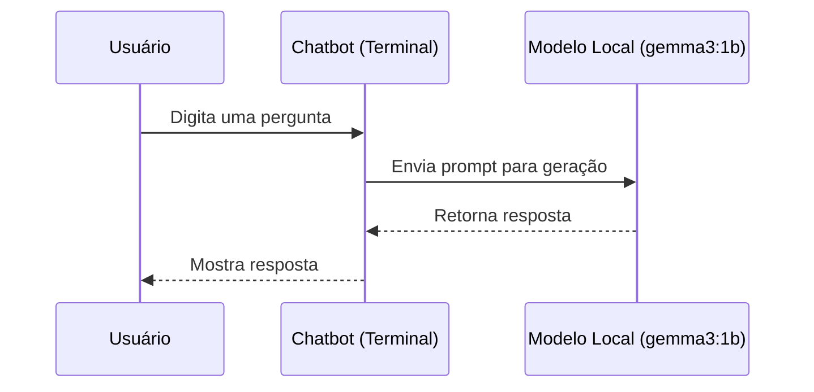

### Descrição
Este projeto cria um chatbot local em linha de comando utilizando o modelo gemma3:1b via Ollama. Ele serve como uma base sólida para a criação de interfaces conversacionais privadas, rápidas e que não dependem da internet ou de APIs de terceiros.

Por ser modular, o chatbot pode ser expandido com:
- Autenticação de usuários
- Histórico de conversas
- Interface web com Flask ou Streamlit
- Integração com bancos de dados
- Suporte a múltiplos modelos
- É ideal para quem deseja estudar o funcionamento de LLMs locais, criar protótipos rápidos, ou garantir mais controle e privacidade na execução de modelos de linguagem.

### Tecnologias
🧠 Ollama – para execução local do modelo de AI LLM gemma3:1b (um SLM poderoso)
🐍 Python 3.8+
📦 requests – biblioteca Python para comunicação com o servidor local do Ollama

### Estrutura
```
ollama-chatbot-cli/
├── chatbot.py
├── config.py
├── main.py
├── requirements.txt
└── .env
```

### Instalação
```bash
git clone https://github.com/4kumon/ollama-chatbot-cli.git
cd ollama-chatbot-cli
pip install -r requirements.txt
```

[Clique aqui para baixar](https://ollama.com/download) e instalar o Ollama para seu sistema operacional

Carregue o modelo ```gemma3:1b```
```ollama run gemma3:1b```

Isso iniciará um servidor local em ```http://localhost:11434```.

### Uso
Com o Ollama rodando em segundo plano:
```bash
python main.py
```
Você poderá conversar com o modelo diretamente pelo terminal.

### Diagrama UML

