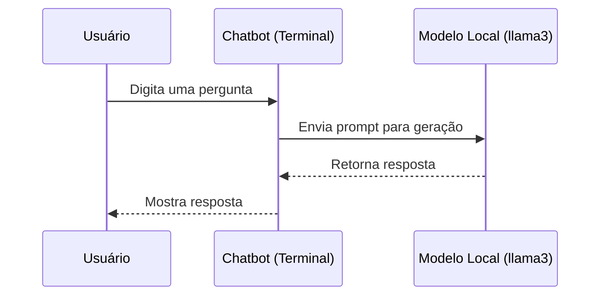

### Estrutura
```
ollama-chatbot-cli/
├── chatbot.py
├── config.py
├── main.py
├── requirements.txt
└── .env
```

### Instalação
```bash
git clone https://github.com/seu-repo/ollama-chatbot-cli.git
cd ollama-chatbot-cli
pip install -r requirements.txt
```

### Configuração
Crie um arquivo .env para armazenar sua chave de API da DeepInfra:
```
DEEPINFRA_API_KEY=your-deepinfra-api-key
```


### Uso
```bash
python main.py
```

### Diagrama UML

