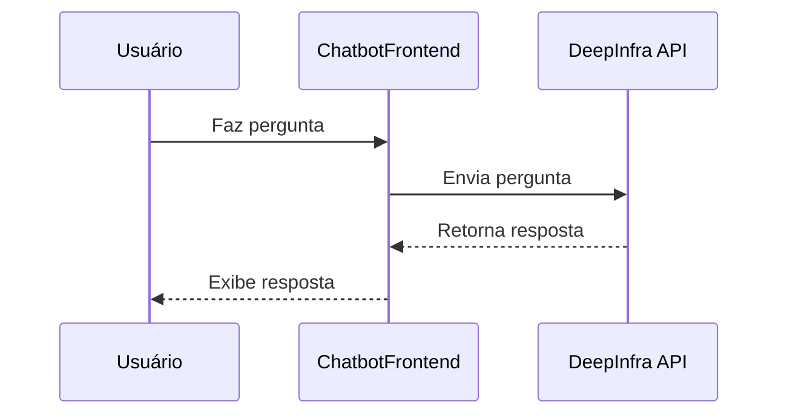

### Estrutura
```
llm-chatbot-with-deepinfra/
├── main.py
├── README.md
└── requirements.txt
```

### Instalação
```bash
git clone https://github.com/seu-repo/llm-chatbot-with-deepinfra.git
cd llm-chatbot-with-deepinfra
pip install -r requirements.txt
```

Substitua sua chave de API no `main.py`:
```python
DEEPINFRA_API_KEY = 'your-deepinfra-api-key'
```

### Uso
```bash
python main.py
```

### Diagrama UML

